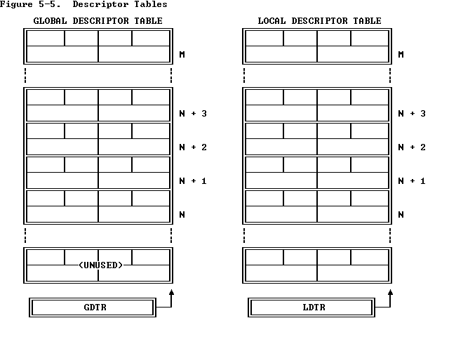
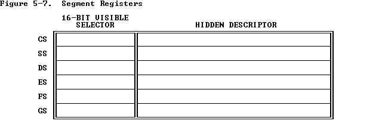
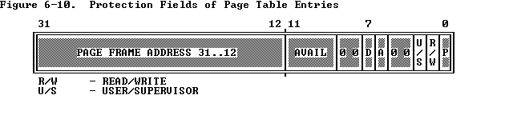

#  Chapter 5 Memory Management

80386将逻辑地址(程序员看到的地址)转换为物理地址(物理内存中具体对应的地址)通过两个步骤

- 段转换(Segment translation)
  - 逻辑地址(segment selector + segment offset)被转换为线性地址
- 页转换(Page translation)
  - 线性地址转换为物理地址（根据OS不同可选）

下图是一个简化版的寻址机制，事实上寻址机制中也包含了一些内存保护


## 5.1 Segment Translation

为了实现转换使用了以下几个数据结构

- Descriptors
- Descriptor tables
- Selectors
- Segment Registers

### 5.1.1 Descriptors

在没有启动分页机制时，线性地址 = 物理地址

描述符为处理器提供了将**逻辑地址转化为线性地址所需要的数据**。Descriptor由编译器、链接器、装载器或者操作系统生成，不是由应用程序员编写的。下图展现了两种描述符的格式。


段描述符有这些域

- BASE: 定义了在4G的线性空间中段的位置。处理器联系这base 地址的三个片段形成单独的32位值 

- LIMIT：定义了段的大小。当处理器联系limit域的两个部分之（20bit），处理器会解释这个limit域通过两个方式

1. 1B为一个单位，定义1MB的上限（16位）
2. 4KB为一个单位，定义4GB的上限（32位）。当装载时这个limit会被<< 12bit，low-order one-bit are inserted

- Granularity bit: 确定LIMIT的粒度。被设置粒度为4KB，不设置粒度为1B

- TYPE: 区分不同的描述符

- DPL (Descriptor Privilege Level): Used by the protection mechanism (refer to [Chapter 6](https://pdos.csail.mit.edu/6.828/2018/readings/i386/c06.htm) ) .

- Segment-Present bit:  如果这个为被置为0，那么就不能使用地址转换。处理器会报异常，当这个描述符的selector被装载进一个segment reg。下图就是segment-present为被置为0的格式。操作系统能够随之标记这个位。当操作系统实现了基于段的虚拟内存时，在这两种情况下他会删除这两个位
  - 当线性空间被段机制扩张，但是并没有被分页机制所映射到
  - 这个段没有被防贼内存中


- Accessed bit: 当段能够被使用时，会设置这个位。描述符的一个selector会被装载进段寄存器，或者描述符被selector 用来测试命令。操作系统实现了段层次的虚拟内存可能会时不时的测试这个位，检测段的使用频率

描述符的构建和维护是系统软件的职责。通常需要编译器、装载器、系统搭建者的合作来共同完成

### 5.1.2 Descriptor Tables

段描述符被存在两种数据结构中

- the global descriptoe table(GDT)
- the local descriptor table(LDT)

描述附表就是一个8字节入口的内存数组，每个成员就是一个描述符。如下图所示



描述符表的大小是不确定的，他最多可以包含8192-8K(2^13)个描述符

GDT(INDEX = 0)的第一个入口通常不是被处理器是用的

处理器通过GDTR、LDTR来确定这两个表在内存中的位置。这些寄存器存储了在线性空间中表的基地址以及段的limit。`LGDT`以及`SGDT`指令能够让我们获取LGDT的值。`LLDT`, `SLDT`两个寄存器让我们能够access LDTR

### 5.1.3  Selector

逻辑地址的(selecor)选择符的那一部分通过确定**描述附表**确定了**描述符**，并且标志了在描述附表中的某一个index。

选择符对于某一些应用程序来说应该是可见的（指针中的某一部分），但是选择符的值通常是由链接器或者装载器来复制的。

选择符的格式如下：(16位)


- Index: 从8292个描述附表项中选择一个描述符。处理器将**index * 8（描述符的长度）**再加上描述附表的基地址，来获取表中的段描述符

- Table Indicator:确定这个选择符指向哪一个描述附表 。A zero indicates the GDT; a one indicates the current LDT.

- Requested Privilege Level: Used by the protection mechanism. (Refer to [Chapter 6](https://pdos.csail.mit.edu/6.828/2018/readings/i386/c06.htm))

因为GDT的入口没有被处理器所之用，所以拥有index为0的选择符以及置表指针为0（selector 指向GDT的第一个入口），他可以用作是空选择符(null selector)。当一段寄存器状态null selector的时候处理器不会抛出异常。但是当这个段寄存器用于获取内存时就会抛出异常。这个特点用于初始化没有用的段寄存器，防止获取以外引用

选择器存放在6个专用寄存器(CS,,,,,,SS)和一个特殊寄存器**LDTR中，如果是获取系统段基址则选择器就是6个专用寄存器，如果是获取任务级别的段基址，则需要两级选择子，第一级为LDRT，第二级就是那6个专用寄存器。**

### 5.1.4 Segment Register

80386将**描述符（descriptor）**的信息存储在段寄存器中，这样就能够避免每次都向内存获取。

每一个寄存器都有可见(visible)的部分以及不可见(invisible)的部分。如下图所示



如果是16位寄存器这些可见的部分可以由程序直接控制。不可见的由其他寄存器控制。

The operations that load these registers are normal program instructions (previously described in [Chapter 3](https://pdos.csail.mit.edu/6.828/2018/readings/i386/c03.htm)). These instructions are of two classes:·

1. Direct load instructions; for example, [MOV](https://pdos.csail.mit.edu/6.828/2018/readings/i386/MOV.htm), [POP](https://pdos.csail.mit.edu/6.828/2018/readings/i386/POP.htm), [LDS](https://pdos.csail.mit.edu/6.828/2018/readings/i386/LGS.htm), [LSS](https://pdos.csail.mit.edu/6.828/2018/readings/i386/LGS.htm), [LGS](https://pdos.csail.mit.edu/6.828/2018/readings/i386/LGS.htm), [LFS](https://pdos.csail.mit.edu/6.828/2018/readings/i386/LGS.htm). These instructions explicitly reference the segment registers.
2. Implied load instructions; for example, far [CALL](https://pdos.csail.mit.edu/6.828/2018/readings/i386/CALL.htm) and [JMP](https://pdos.csail.mit.edu/6.828/2018/readings/i386/JMP.htm). These instructions implicitly reference the CS register, and load it with a new value.

Using these instructions, a program loads the visible part of the segment register with a 16-bit selector. The processor automatically fetches the base address, limit, type, and other information from a descriptor table and loads them into the invisible part of the segment register.

Because most instructions refer to data in segments whose selectors have already been loaded into segment registers, the processor can add the segment-relative offset supplied by the instruction to the segment base address with no additional overhead.

### 5.1.5 Summery

一个虚拟地址可以分为selector + offset。

在内存中存储着GDT以及LDT两个表，我们可以使用selector*8 + GDT/LDT_Base来获取表中的某一个描述粗将他存入到内存中。从而获取目前我们在哪个段之中。然后使用这个段的基地址+我们的offset就能得到具体现在对应的线性地址

## 5.2 Page Translation

通过分段转换我们可以将逻辑地址转换为线性地址，地址转换的第二阶段，80386会通过分页机制将线性地址转换为物理地址。

地址转换的这个阶段实现了面向页的虚拟内存系统以及页及的保护机制


分页机制是可选的，只有当CR0寄存器中的PG被设置了才会启动分页机制。这个位是被操作系统中的软件初始化的过程中实现的。如果操作系统想要实现多任务、面向页保护以及面向页的虚拟内存机制，PG为一定要被设置。

### 5.2.1 Page Frame

一个页帧是物理地址中4KB为单位的连续地址空间。

### 5.2.2 Linear Address

通过页表(page table)，线性地址(liearn Address)间接地指向物理地址。页在一个表中，表中的偏移量就可以得到对应的物理地址。

下图就是我们的线性地址


下图展现了如何使用`二级页表`将线性地址的DIR、PAGE、OFFSET转换为对应的物理地址。

这个寻址机制使用DIR域作为page_dir的引索找到一个page_table，然后使用PAGE域来作为page_table的引索找到某一个具体的页面，随后使用OFFSET域来确定这个页中具体的位置。


### 5.2.3 Page Table

页表是32位数组的一个页标识符。页表它本身就是一个页，因此他有4KB的内存，或者最多有1K的 32-bit 入口.

两级页表用于确定内存中某个页的位置。比较高阶的一层是页目录(page directory)。页目录会记录第二层pagetable中1K大小的pagetable地址。第二层的也标会记录1K的页面。所有的表被一个目录所包含。因此我们可以映射1M的页。因为每个页的大小为4KB。所以一个页目录的所有表能够包含80386整个物理地址空间4GB

现在正在使用的**页目录的物理地址**被存放在CPU的**CR3寄存器**中，也叫做页目录基地址寄存器(page directory base register)。内存管理的软件拥有为所有任务使用页目录的权利。每一个页目录对应一个任务，当然有一些任务需要两个页目录。

### 5.2.4 Page-Table Entries

上述两个不同页表他们都有共同的格式，如下：


#### 5.2.4.1 Page Frame Address

页帧地址指明了某个页的起始物理地址。因为页被限制在4K的范围，低12位通常为0。

在页目录中，页帧地址所对应的就是页表的地址。

在页表中，页帧地址就是就是包含着我们希望的内存源的那个页帧地址。

The page frame address specifies the physical starting address of a page. Because pages are located on 4K boundaries, the low-order 12 bits are always zero. In a page directory, the page frame address is the address of a page table. In a second-level page table, the page frame address is the address of the page frame that contains the desired memory operand.

#### 5.2.4.2 Present Bit

这个bit用于表明这个bit能否用于地址转换。P=1表明能够用于地址转换。

无论在哪个层级的页表中，当P=0,那么向对这个进行地址转换是不能够得。但是其他的入口地址能够被软件所使用。

**并且这些所有位都不是被硬件所设置的**

下图展现了当P被设置为0时的页表的格式


当P被置为0，无论在哪一层页表中，如果使用该入口用于地址转换将会造成处理器抛出异常。

如果软件系统支持分页虚拟内存，page-not-present的异常处理会将需要的页面放入内存中。造成异常的指令会被重新执行。

需要注意，对于页目录本身来说并没有present-bit，他的这个bit是对于某个页表来说的。某个页目录可能会not-present是因为他所在的这个任务被挂起了，但是操作系统需要保证在某个任务被释放之前，CR3指示的这个页目录需要存在在物理内存中

#### 5.2.4.3  Accessed and Dirty Bits

这些为提供了页在不同层级的表中的使用信息。除了页目录中的dirty-bit，这些位都被硬件设置，处理器不会清理这之中的任何位。

在对某个表进行读写时，处理器会设置对应的两层表中的accessed-bit

在向某个页表入口覆盖的页中写数据时，处理器会设置第二层页表的dirty-bit。页目录中的dirty-bit是没有被设置的。

当需要内存增加时，一个支持分页的操作系统能够使用这些位，来决定是否将这些也从内存中删除。操作系统需要测试清理这些位。

#### 5.2.4.4 Read/Write and User/Supervisor Bits

These bits are not used for address translation, but are used for page-level protection, which the processor performs at the same time as address translation .

### 5.2.5 Page Translation Cache

For `greatest efficiency` in address translation, the processor stores the most recently used page-table data in an` on-chip cache`. Only if the necessary paging information is not in the cache must both levels of page tables be referenced.

**The existence of the page-translation cache is invisible to applications programmers but not to systems programmers**; operating-system programmers must flush the cache whenever the page tables are changed. The page-translation cache can be flushed by either of two methods:

1. By reloading CR3 with a

   MOV

   instruction; for example:

   ```
   MOV CR3, EAX
   ```

2. By performing a task switch to a TSS that has a different CR3 image than the current TSS . (Refer to [Chapter 7](https://pdos.csail.mit.edu/6.828/2018/readings/i386/c07.htm) for more information on task switching.)

## 5.3 Combinging Segment and Page Translation

下图就是当分页机制启动时，将分段分页两个阶段结合在一起的一个从虚拟地址(virtual address)到物理地址(physical address)的过程


### 5.3.1 "Flat" Architecture

当80386被用于执行被设计为没有段的程序时，他可能会调整他关闭80386的分段机制。

80386并没有使能分段的模式，但是可以最初装使用**包含整个32位地线性地址空间的描述符所指向的选择符** 装载 段寄存器来达到同样的目的。一旦装载段寄存器不能改变。32位的偏移量对于搜搜整个线性空间是足够的

### 5.3.2 Segments Spanning Several Pages

80386架构允许段比页的大小(4KB)大或者小。例如某个段用于寻址并保护某个很大的数据结构，他有132KB。软件系统中支持分页的虚拟内存，他并不需要整个结构一次性都在内存中。这个结构会被分成33个页面，他们中的任何一个可能都没有被装载在内存中。应用程序员并不需要一直到虚拟内存子系统正在以这种方法分页这个结构。

### 5.3.3 Pages Spanning Several Segments

另一方面，段可能会比某个页的大小小。例如一个数据结构，例如信号量。由于他被段所保护以及共享，所以为每一个信号量都创建一个段是有意义的。但是因为系统可能并不需要这么多信号量，所以给每个信号量分配一个页是十分不合算的。所以将一个页分为很多段也是有意义的

### 5.3.4 Non-Aligned Page and Segment Boundaries

80386不会强制页和段之间任何的相似。如果一个页包含一个段的尾部和一个段的开头是完全可以接受的。就像一个段可能也会包含一个页的开头和另一个页的结尾。


### 5.3.5 Aligned Page and Segment Boundaries

如果强制也和段的一直可能会让内存管理更简单。例如一个段被分配一个页，

Memory-management software may be simpler, however, if it enforces some correspondence between page and segment boundaries. For example, if segments are allocated only in units of one page, the logic for segment and page allocation can be combined. There is no need for logic to account for partially used pages.

### 5.3.6 Page-Table per Segment

An approach to space management that provides even further simplification of space-management software is to maintain a one-to-one correspondence between segment descriptors and page-directory entries, as [Figure 5-13](https://pdos.csail.mit.edu/6.828/2018/readings/i386/s05_03.htm#fig5-13) illustrates. Each descriptor has a base address in which the low-order 22 bits are zero; in other words, the base address is mapped by the first entry of a page table. A segment may have any limit from 1 to 4 megabytes. Depending on the limit, the segment is contained in from 1 to 1K page frames. A task is thus limited to 1K segments (a sufficient number for many applications), each containing up to 4 Mbytes. The descriptor, the corresponding page-directory entry, and the corresponding page table can be allocated and deallocated simultaneously.

# Chapter 6 Protection

## 6.1 Why Protection?

The purpose of the protection features of the 80386 is to **help detect and identify bugs**. The 80386 supports sophisticated applications that may consist of hundreds or thousands of program modules. In such applications, the question is **how bugs can be found and eliminated as quickly as possible and how their damage can be tightly confined**. To **help debug applications faster and make them more robust in production**, the 80386 contains mechanisms to verify memory accesses and instruction execution for conformance to protection criteria. These mechanisms may be used or ignored, according to system design objectives.

- 帮助80386检测、定位bugs
- 帮助debug应用坑狗更快更有鲁棒性

## 6.2 Overview of 80386 Protection Mechanisms

Protection in the 80386 has five aspects:

- Type checking
- Limit checking
- Restriction of addressable domain
- Restriction of procedure entry points
- Restriction of instruction set

80386的保护硬件是内存管理硬件的一部分。可一分别应用在段转换以及页转换的过程中。

The protection hardware of the 80386 is an integral part of the memory management hardware. Protection applies both to **segment translation** and to **page translation**.

任何访问地址的操作都会**被硬件来确实是否符合规范**。所有的检查都会在内存循环开始之前。任何的隔离都避免了循环从开始到异常。因为检查适合寻址同时进行的，所以这里**不会有性能损失**。

Each reference to memory is **checked by the hardwar**e to verify that it satisfies the protection criteria. **All these checks are made before the memory cycle is started**; any violation prevents that cycle from starting and results in an exception. Since the **checks are performed concurrently with address formation**, there is no performance penalty.

不合法的访问地址会因此异常

Invalid attempts to access memory result in an exception. Refer to [Chapter 9](https://pdos.csail.mit.edu/6.828/2018/readings/i386/c09.htm) for an explanation of the exception mechanism . The present chapter defines the protection violations that lead to exceptions.

**“privilege**”这个概念是保护机制的多个方面的中心思想。应用在进程，‘privilege’就会决定某个进程能够信任他不会犯错来影响别的进程。应用在数据上，‘privilege’就是某个数据结构对于某个进程的保护的级别

The concept of "privilege" is central to several aspects of protection (numbers 3, 4, and 5 in the preceeding list). Applied to procedures, privilege is the degree to which the procedure can be trusted not to make a mistake that might affect other procedures or data. Applied to data, privilege is the degree of protection that a data structure should have from less trusted procedures.

‘privilege’这个概念被应用在分段分页这两个保护机制中

The concept of privilege applies both to segment protection and to page protection.

# 6.4 Page-Level Protection

Two kinds of protection are related to pages:

1. Restriction of addressable domain.可寻址域的限制
2. Type checking.类型检查

### 6.4.1 Page-Table Entries Hold Protection Parameters

下图高亮的那两位就是PTEst和PDEs的控制位



#### 6.4.1.1 Restricting Addressable Domain

为页面的`privilege`这个概念是通过为每个页都设置两个等级之一的优先级：

- Supervisor level(U/S = 0) -- 给操作系统或者其他的系统级软件和相关数据来使用；

- User level(U/S = 1) -- 给应用进程或者数据。

目前的登记(U or S)是与CPL有关系的。如果CPL是0，1，2那么处理器会执行supervisor登记，所有的压面都是可寻址的。然而，当处理器正在user等级执行时，只有那些属于user level的页面才可以被寻址。

#### 6.4.1.2 Type Checking

页面寻址的某个等级中，邮箱中类型可以被定义。

1. Read-only access (R/W = 0)

2. Read/write access(R/W = 1)

When the processor is executing at user level, only pages that belong to user level and are marked for read/write access are writable; pages that belong to supervisor level are neither readable nor writable from user level.

### 6.4.2 Combining Protection of Both Levels of Page Tables

For any one page, the protection attributes of its page directory entry may differ from those of its page table entry. The 80386 computes the effective protection attributes for a page by examining the protection attributes in both the directory and the page table. Table 6-5 shows the effective protection provided by the possible combinations of protection attributes.

### 6.4.3 Overrides to Page Protection

Certain accesses are checked as if they are privilege-level 0 references, even if CPL = 3:

- LDT, GDT, TSS, IDT references.

- Access to inner stack during ring-crossing [CALL](https://pdos.csail.mit.edu/6.828/2018/readings/i386/CALL.htm)/[INT](https://pdos.csail.mit.edu/6.828/2018/readings/i386/INT.htm).