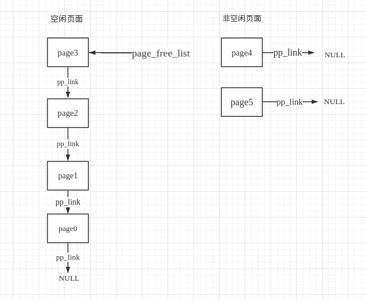

# Lab 2: Memory Management

## Introduction

内存管理有两个部分组成

- physical memory allocator：kernel能够分配物理内存并且可以在之后释放他
  - 我们的allocator会作用在4096Bytes（4K）的单元上  --  页
  - 我们需要做的就是控制记录了物理页的数据结构来分配或者释放、以及有多少进程正在共享分配的页
  - 我们也需要写一些规则来分配释放内存的空闲页
- virtual memory：内核和应用程序使用的**虚拟地址被映射到物理地址**
  - 当指令使用内存或者请求页表的集合时，x86硬件 **内存管理单元（Memory Management Unit）**执行了映射这个活动
  - 我们会修改JOS来设置MMU的page table

### Getting started

我们需要获取MIT工作人员为我们提供的新的需要使用的git来管理我们的项目。

安装官网说的就可以完成。

接着我们的lab中会多出来几个文件

- `inc/memlayout.h`
- `kern/pmap.c`
- `kern/pmap.h`
- `kern/kclock.h`
- `kern/kclock.c`

`memlayout.h`他描述了我们虚拟地址空间的布局。我们需要修改`pmap.c`这个文件来实现。

`memlayout.h`, `pmap.h`这两个文件定义了`PageInfo`这个数据结构，我们会使用这个数据结构来跟踪物理地址中那个一页被释放了。

`kclock.h`, `kclock.c`这两个文件操控了PC的battery-backed clock and CMOS RAM 这两个硬件，这之中BIOS记录了PC拥有的物理内存。

`pmap.c`需要读取设备硬件，来指出有多少物理地址空间，我们不需要知道CMOS如何工作

## Part 1: Physical Page Management

操作系统需要跟踪物理RAM中哪些部分可用,哪些部分已经被分配。JOS使用页来管理电脑的物理内存，便于MMU来映射以及保护已经被分配的内存

现在我们需要写一个物理页的allocator。他会使用`struct PageInfo`的一个链表来跟踪哪些页面是空闲的，每一个结构体都对应着一个空闲的物理页。

### **Exercise 1.**

>  In the file `kern/pmap.c`, you must implement code for the following functions (probably in the order given).
>
> ```
> `boot_alloc()`
> `mem_init()` (only up to the call to `check_page_free_list(1)`)
> `page_init()`
> `page_alloc()`
> `page_free()
> ```
>
> `check_page_free_list()` and `check_page_alloc()` test your physical page allocator. You should boot JOS and see whether `check_page_alloc()` reports success. Fix your code so that it passes. You may find it helpful to add your own `assert()`s to verify that your assumptions are correct.

> 如果我们将panic注释掉会显示
>
> Physical memory: 131072K available, base = 640K, extended = 130432K
>
> 可以看到物理内存中，除了内核已经占用的，我们在base段可用的有640K对应着我们lab1中的low memory

#### boot_alloc()

这个函数只有在JOS在设置他自己的虚拟内存系统的时候会使用

如果n > 0，分配能够包含nBytes的连续物理页，不会初始化内存，返回内存需要的虚拟地址

如果n == 0，直接返回下一个可用页的地址，不需要分配过多的物理地址空间

如果内存不够那么就报错，这个函数只会在初始化的时候使用，当已经成功创建`page_free_list list`之后就不会使用这个函数了

```c
static void *
boot_alloc(uint32_t n)
{
	static char *nextfree;	// virtual address of next byte of free memory
	char *result;

	// Initialize nextfree if this is the first time.
	// 'end' is a magic symbol automatically generated by the linker,
	// which points to the end of the kernel's bss segment:
	// the first virtual address that the linker did *not* assign
	// to any kernel code or global variables.
	if (!nextfree) {
		extern char end[];
		nextfree = ROUNDUP((char *) end, PGSIZE);
	}

	// Allocate a chunk large enough to hold 'n' bytes, then update
	// nextfree.  Make sure nextfree is kept aligned
	// to a multiple of PGSIZE.
	//
	// LAB 2: Your code here.
  if (n == 0) {
          return nextfree;
      }
  result = nextfree;
  nextfree += ROUNDUP(n, PGSIZE);
  return result;
}
```

> .bss段存放的是没有初始化的变量，end他指向内的bss段的末尾（虚拟地址）

我们使用` objdump -h kernel`

```c
obj/kern/kernel:     file format elf32-i386

Sections:
Idx Name          Size      VMA       LMA       File off  Algn
  0 .text         00001ae7  f0100000  00100000  00001000  2**4
                  CONTENTS, ALLOC, LOAD, READONLY, CODE
  1 .rodata       000007b0  f0101b00  00101b00  00002b00  2**5
                  CONTENTS, ALLOC, LOAD, READONLY, DATA
  2 .stab         00004069  f01022b0  001022b0  000032b0  2**2
                  CONTENTS, ALLOC, LOAD, READONLY, DATA
  3 .stabstr      00001bde  f0106319  00106319  00007319  2**0
                  CONTENTS, ALLOC, LOAD, READONLY, DATA
  4 .data         0000a300  f0108000  00108000  00009000  2**12
                  CONTENTS, ALLOC, LOAD, DATA
  5 .bss          00000650  f0112300  00112300  00013300  2**5
                  ALLOC
  6 .comment      0000002b  00000000  00000000  00013300  2**0
                  CONTENTS, READONLY
```

这里我们看出.bss段已经是kernel的最后一段了，因此end指向的就是第一个内核之后没有使用的**虚拟内存地址**。（没有被linker赋予任何kernel的code以及全局变量）

注意.comment没有没有加入到最终的内存中

所以在系统第一次调用boot_alloc()这个函数的时候，如果第一次执行nextfree会被指向kernel后第一个空闲页的首地址。接下来，根据输入的n，来分配地址。如果n=0，则返回nextfree，否则分配n字节的地址，nextfree指向下一个空闲页的地址，返回分配地址的首地址。注意，整个过程中，需要4K对齐。

> ROUNDUP，定义在`inc/types.h`中
>
> ROUNDUP的作用是用于4K对齐，页对齐

- 返回能够包含nbytes的页地址。如果n=0，返回当前空闲页地址

#### mem_init()

> JOS一共设置两层页表，pg_dir，pg_tbl
>
> kern_pgdir是他的根线性(虚拟)地址
>
> 这个函数仅仅设置地址**空间的内核部分**（addresses >= UTOP）
>
> UTOP：TOP of User accessible VM
>
> 用户的地址空间在后面设置

首先我们需要了解`sturct PageInfo`的数据结构是怎样的，`inc/memlayout.h`

```c
/* 这个结构体，主要是用来保存内存中的所有物理页面的信息的。
 * 每一个PageInfo对应一个物理页面。
 * 页描述符结构，被映射在UPAGE
 * 能够像kernel读写数据，但是对于用户来说是只读的
 *
 * 每一个PageInfo都为一个物理页存储了1M的信息
 * 他并不是物理页本身，但是却和它有着一一对应的关系
 * 使用 page2pa() in kern/pmap.h 就能将PageInfo转为对应的物理地址
 */
struct PageInfo {
	// 在list上的下一个page pointer
	struct PageInfo *pp_link;

	// pp_ref is the count of pointers (usually in page table entries) to this page, for pages allocated using page_alloc.
	// Pages allocated at boot time using pmap.c's
	// boot_alloc do not have valid reference count fields.

	uint16_t pp_ref;
};
```

> 4: npages_basemem = 160
> 3: npages = 32768
>
> 4: &end = (<data variable, no debug info> *) 0xf0114970
> 2: pages = (struct PageInfo *) 0xf0116000
> 1: kern_pgdir = (pde_t *) 0xf0115000

通过这写数据我们可以知道一个页面的大小为4KB，目前可用的页面数为32k，所用一共可以用到的内存大小为128M，这个与我们i386_init()函数中爆出可用内存大小的`Physical memory: 131072K available`所对应。

kern_pgdir被维护在kernel之后的第一页

pages本质上是一个`struct PageInfo`的数组，这个数组维护了32k个物理页的信息，他被维护在kernel之后32个页面中。

```rust
pages = (struct PageInfo *) boot_alloc(npages * sizeof(struct PageInfo));
memset(pages, 0, npages * sizeof(struct PageInfo));
```

#### page_init()

> pages这个数组中的每一个元素对应着一个物理页。通过`((pp - pages) << 12)`就能够得到这个pageinfo对应的物理页地址。然后通过`+0xf0000000`就能够得到这个物理页对应的虚拟地址。
>
> pages被维护在kernel之上的第二个页面之后
>
> 页会被有次数的引用
>
> 空闲的页被存在page_free_list这个指针中
>
> 这个函数中我们需要做的就是初始化pages数组以及page_free_list这个指针
>
> 注意：当调用完这个函数后我们就不能使用`boot_alloc()`来分配页了。

```cpp
void
page_init(void)
{
    // NB: DO NOT actually touch the physical memory corresponding to
    // free pages!
    size_t i;
    //  1) Mark physical page 0 as in use.
    //     This way we preserve the real-mode IDT and BIOS structures
    //     in case we ever need them.  (Currently we don't, but...)
    pages[0].pp_ref = 1;

    //  2) The rest of base memory, [PGSIZE, npages_basemem * PGSIZE)
    //     is free.
    for (i = 1; i < npages_basemem; i++) {
        pages[i].pp_ref = 0;
        pages[i].pp_link = page_free_list;
        page_free_list = &pages[i];
    }

    //  3) Then comes the IO hole [IOPHYSMEM, EXTPHYSMEM), which must
    //     never be allocated.
    for (i = IOPHYSMEM/PGSIZE; i < EXTPHYSMEM/PGSIZE; i++) {
        pages[i].pp_ref = 1;
    }

    //  4) Then extended memory [EXTPHYSMEM, ...).
    //     Some of it is in use, some is free. Where is the kernel
    //     in physical memory?  Which pages are already in use for
    //     page tables and other data structures?
  	/*
  	我们知道我们可以使用boot_alloc()函数来得到了kernel之后可用的虚拟页地址，而这里我们调用page_init是为了初始化物理地址表，初始化的是是页面对应的物理地址，所以要的到某个物理地址的引索我们需要使用PADDR() --  本质上就是-0xf0000000
  	
  	将我们的虚拟地址转换为物理地址
  	*/
    size_t first_free_address = PADDR(boot_alloc(0));
    for (i = EXTPHYSMEM/PGSIZE; i < first_free_address/PGSIZE; i++) {
        pages[i].pp_ref = 1;
    }
    for (i = first_free_address/PGSIZE; i < npages; i++) {
        pages[i].pp_ref = 0;
        pages[i].pp_link = page_free_list;
        page_free_list = &pages[i];
    }
}

/* This macro takes a kernel virtual address -- an address that points above
 * KERNBASE, where the machine's maximum 256MB of physical memory is mapped --
 * and returns the corresponding physical address.  It panics if you pass it a
 * non-kernel virtual address.
 */
// KERNBASE 在 inc/memlayout.h 中被定义为 0xF0000000
#define PADDR(kva) _paddr(__FILE__, __LINE__, kva)
static inline physaddr_t
_paddr(const char *file, int line, void *kva)
{
    if ((uint32_t)kva < KERNBASE)
        _panic(file, line, "PADDR called with invalid kva %08lx", kva);
    return (physaddr_t)kva - KERNBASE;
}
```

- 这个初始化的思路就是自低向上进行初始化。首先将物理内存最底部的实模式下的IDT以及一些BIOS的结构可能会占用的低0页初始化为占用。
- 接着是BASE Memory中空闲的一段空间作为不可用
- 接着就是IO的设备地址、Kernel的地址
- 最后就是剩下的所有的空闲页


需要注意的是，下面代码的作用是把页面设为空闲，并插入链表头：

```c
        pages[i].pp_ref = 0;
        pages[i].pp_link = page_free_list;
        page_free_list = &pages[i];
```

在这个实验系统中，采用了一个比较巧妙的结构，通过page_free_list这个变量来完成页面的申请和调用。

首先，页面的结构如下图所示：



通过图我们可以了解到整个`page_freelist`是一个倒置的链表，因为在空闲页面的结构的建立过程中，是从下往上建立的，相当于在链表里面，其头节点是一个NULL指针。而使用过程中，整个结构类似于一个栈，采用先进后出的原则，`page_free_list`指向栈顶点。

在刚开始的时候，`page_free_list =0`，page_free_list表示系统的当前空闲页面。 初始化时，插入第一个空闲页表，把page_free_list赋值给空闲页表的pp_link，然后更新page_free_list，使得其指向第一个空闲页表(图中page0), 依次操作，直到空闲页表插入完毕。当free_page的时候，只需按照上面的过程，插入被释放的空闲页面就可以了。当系统申请空闲页表时，只需给出page_free_list所指向的页表就行，然后更新page_free_list.当page_free_list = NULL时，表示没有空闲页表。

总的来说，**整个空闲页面的使用更像是一个栈**。在整个结构中，page_free_list 起着很关键的作用。

这种结构，对于较大单位空间的管理比较有效，即简单又高效。如果把单位页面的大小缩小，考虑极端情况，以16B为一个页面，那么这种页面管理方法就不行了。可以看到，每个**pageInfo里面有两个变量，一个位指针，一个为int， 即一个page的大小为8字节**，以8字节来管理16字节大小的页面，到时候整个内存中，有50%都是pages结构体。浪费的空间非常巨大。而对于实验中的**4K大小的页面，其空间利用率就非常高，整个pages占的空间大小大约为8/4000**。

总的来说，这种管理方式和**结构使用于大单位内存的管理**。而对于堆内存的管理，由于**堆的申请是以4或8字节为单位的，相当于页面大小位4B/8B**，这种管理方法就不可行了。

#### page_alloc()

这个函数主要是完成页面的分配。所谓分配是基于 PageInfo，即管理层面的，并没有真正进行内存的分配。更加恰当的说法是标记为已使用。

```c
//
// Allocates a physical page.  If (alloc_flags & ALLOC_ZERO), fills the entire
// returned physical page with '\0' bytes.  Does NOT increment the reference
// count of the page - the caller must do these if necessary (either explicitly
// or via page_insert).
//
// Be sure to set the pp_link field of the allocated page to NULL so
// page_free can check for double-free bugs.
//
// Returns NULL if out of free memory.
//
// Hint: use page2kva and memset
struct PageInfo *
page_alloc(int alloc_flags)
{
    // Fill this function in
    if (page_free_list == NULL) {
        return NULL;
    }
    struct PageInfo *allocated_page = page_free_list;
    page_free_list = page_free_list->pp_link;
    allocated_page->pp_link = NULL; 
    if (alloc_flags & ALLOC_ZERO) {
        memset(page2kva(allocated_page), '\0', PGSIZE);
    }
    return allocated_page;
}
```

基本没什么值得说的，按着提示走，不用手动增加引用计数，调用者会做这个事。page2kva 函数的作用就是通过物理页获取其内核虚拟地址。另外分配后的页面需要将 pp_link 指针设置为 NULL。

我们从`page2kva`这个函数就可以了解到无论是pagedirectory还是pagetable他们都是存在于**内核空间**的。我们可以直接使用`page2kva(pp)`来获得某个页的虚拟地址。

#### page_free()

```c
//
// Return a page to the free list.
// (This function should only be called when pp->pp_ref reaches 0.)
//
void
page_free(struct PageInfo *pp)
{
    // Fill this function in
    // Hint: You may want to panic if pp->pp_ref is nonzero or
    // pp->pp_link is not NULL.
    if (pp->pp_ref > 0 || pp->pp_link != NULL) {
        panic("Double check failed when dealloc page");
        return;
    }
    pp->pp_link = page_free_list;
    page_free_list = pp;
}
```

唯一需要注意的就是释放后需要加入空闲页列表之中，不用手动将引用清0，调用者会做这件事。

## Part 2 : Virtual Memory

### **Exercise 2.** 

> Look at chapters 5 and 6 of the [Intel 80386 Reference Manual](https://pdos.csail.mit.edu/6.828/2018/readings/i386/toc.htm), if you haven't done so already. Read the sections about page translation and page-based protection closely (5.2 and 6.4). We recommend that you also skim the sections about segmentation; while JOS uses the paging hardware for virtual memory and protection, segment translation and segment-based protection cannot be disabled on the x86, so you will need a basic understanding of it.
>

> Note is put in another makedown file (80386/Memory\ Management.md)

### Virtual, Linear, and Physical Memory

- 虚拟地址：在x86中，一个**虚拟地址(virtual address)**是由一个**段选择符(segement selector)**以及一个**段内偏移量(offset)**组成的。

- 线性地址：而**线性地址(linear address**)则是在**页转换(Page Translation)**之前通过**段转换(Segement Translation)**得到的地址。

- 物理地址：物理地址就是在段、页转换后得到的最终可以通过总线在RAM中寻址的地址

  ```
    				Selector   +--------------+         +-----------+
    			 ----------> |              |         |           |
               				 | Segmentation |         |  Paging   |
  Software             |              |-------->|           |---------->  RAM
              Offset   |  Mechanism   |         | Mechanism |
            ---------->|              |         |           |
                       +--------------+         +-----------+
              Virtual                   Linear                Physical
  
  ```

一个**C的指针本质**上是**虚拟地址的段内偏移量部分(offset)**。在boot/boot.S文件中，我们安装了一个**全局描述附表(Global Descriptor Table, GDT)**,他可以有效的将段转换机制失效，通过设定所有的**段基地址(segment base address)为0**,并且设置限制**(limit)为`0xffffffff`**。因此，段选择符(selector)并没有起作用，所以线性地址总是等于虚拟地址的段内偏移量(offset)。在lab3中我们就不得不和段打一些交道，来设置特权级别。但是对于我们现在的内存管理来说，我们可以不需要管段转换机制，而把注意力放在页转换机制上。

回想一下我们在lab1中的part3，我们安装了一个简易版本的页表，让内核能够在他的链接地址`0xf0100000`上运行,尽管它事实上正好是装载在地址在`0x00100000`ROM BIOS之上的。而这个页表事实上仅仅映射了内存的4MB。我们在这个实验中会在为JOS设置他的虚拟地址空间的布局。在地址为`0xf0000000`，我们将虚拟地址空间的映射扩张到物理内存的256MB，并且映射虚拟内存空间中的一些其他的区域。

### **Exercise 3.** 

> While GDB can only access QEMU's memory by virtual address, it's often useful to be able to inspect physical memory while setting up virtual memory. Review the QEMU [monitor commands](https://pdos.csail.mit.edu/6.828/2018/labguide.html#qemu) from the lab tools guide, especially the `xp` command, which lets you inspect physical memory. To access the QEMU monitor, press Ctrl-a c in the terminal (the same binding returns to the serial console).
>
> Use the xp command in the QEMU monitor and the x command in GDB to inspect memory at corresponding physical and virtual addresses and make sure you see the same data.
>
> Our patched version of QEMU provides an info pg command that may also prove useful: it shows a compact but detailed representation of the current page tables, including all mapped memory ranges, permissions, and flags. Stock QEMU also provides an info mem command that shows an overview of which ranges of virtual addresses are mapped and with what permissions.

首先我们开启两个端口分别属于`make qemu-nox-gdb`, `make gdb`指令，然后在运行gdb的端口随意打一个端点，注意需要将这个端点打在已经进行了分页机制之后。然后我们在两个终端中查看对应的物理地址和虚拟地址所指向的内容。具体如下：

```shell
(qemu) xp/8x 0x00100f67
0000000000100f67: 0x5657e589 0x2cec8353 0x000015b8 0xfa18e800
0000000000100f77: 0xc389ffff 0x000017b8 0xfa0ce800 0xc689ffff
(qemu)

(gdb) x/8x 0xf0100f67
0xf0100f67 <mem_init+1>:        0x5657e589      0x2cec8353      0x000015b8      0xfa18e800
0xf0100f77 <mem_init+17>:       0xc389ffff      0x000017b8      0xfa0ce800      0xc689ffff
(gdb)
```

我们可以看到在虚拟地址`0xf0100f67`以及qemu中对应的物理地址`0x00100f67`中所对应的内存中的内容是一样的。所以我们可以确定lab1中完成的4MB的虚拟地址映射时正确的。

**From code executing on the CPU, once we're in protected mode (which we entered first thing in boot/boot.S), there's no way to directly use a linear or physical address. All memory references are interpreted as virtual addresses and translated by the MMU, which means all pointers in C are virtual addresses.**

CPU开始执行代码时，我们就在保护模式之中(也就是我们在boot/boot.S中完成的第一件事)，那么也就意味着我们不可能直接使用线性地址或者物理地址。所有的内存引索都被翻译为虚拟地址并且通过MMU转换为物理地址，也就是说我们所有的**C指针都是虚拟地址.**

**JOS的内核通常需要控制地址作为不透明的、间接地变量或者作为整**数,而不去取他们的值(dereference的意思就是通过地址去内存中寻找具体的值)，例如在我们的物理内存分配其中(physical memory allocator)。有时他们是虚拟地址，有时他们是物理地址。为了编码方便，JOS的源码提供了两个不同的类型`uintptr_t`代表不透明的虚拟地址，`physaddr_t`代表物理地址。这两种类型都是32位整数类型`uint32_t`的同义词，所以编译器不会阻止你，当你想将一个转换为另一个时。他们都是整数类型(而不是指针类型)，但是如果你想通过他们来寻址，查看这个指针的内容的话，编译器是会阻止你的。

如果你想通过`uintptr_t`来寻址，那么你需要将这个类型的变量强制转换为**指针类型**。相反内核不哼饼干的去去一个物理地址的值，因为MMU会转换所有的内存访问。如果你将`physaddr_t`装换为指针，并且寻址，你可能会装载并存储结果的地址(硬件会将他处理为虚拟地址)，但是可能你就不能得到你想要的那个对应的内存地址了。

总结一下就是说：

| C type       | Address type |
| ------------ | ------------ |
| `T*`         | Virtual      |
| `uintptr_t`  | Virtual      |
| `physaddr_t` | Physical     |

**Question**

1. Assuming that the following JOS kernel code is correct, what type should variable `x`have `uintptr_t` or `physaddr_t`?

   ```c
   	mystery_t x;
   	char* value = return_a_pointer();
   	*value = 10;
   	x = (mystery_t) value;
   ```

根据前面的阅读资料，我们知道JOS中所有的指针都应该是虚拟地址，而不应该是物理地址。所以mystery_t应该是`unintptr_t`

JOSkernel有时需要读取或者修改那些我们仅仅知道物理地址的内存。例如，向页表中加入映射，可能就会需要分配物理内存来存储也页目录并且初始化他。然而，kernel不能够避免通过虚拟地址的转换，因此我们不能够直接装载存储到物理地址中。JOS将物理地址的起始段`0x00000000`映射到`0xf0000000`的一个原因就是帮助内核在只知道物理内存的时候如何向内存读写。为了能够让内核能够通过物理地址进行内存读写，kernel需要将物理地址+`0xf0000000`来将物理地址转换到对应的虚拟地址。我们可以使用内核提供的`KADDR(oa)`函数来将物理地址转换为虚拟地址。

在给出一个某个内核数据结构内存的虚拟地址时，JOSkernel有时也需要这个数据结构对应的物理地址。Kernel全局变量和内存是由`boot_alloc()`函数分配的，他们就在kernel所在的区域(虚拟地址从0xf0000000)，这个区域的所有地址我们都将他们映射到了物理地址。因此我们要将这个区域的虚拟地址转换为物理地址，kernel仅仅需要减去`0xf0000000`.我们需要使用`PADDR(va)`函数来做减法。

### Reference counting

在之后的lab中我们需要总是同时将**同样的物理页**映射到**不同的多个虚拟地址**（或者说很多个环境的地址空间）。我们需要记录每个物理页他的被引用次数(在 `struct PageInfo`的`pp_ref`成员中)。当某一个物理页面的被引用次数为0时(pp-ref == 0)，那么这个页就可以被时放点，因为他不会在被使用了。

总的来说呢，这个数字应该和在所有页表中，在UTOP之下，物理页出现的次数相同。（在UTOP之上的映射都被kernel在启动时初始化完毕了，他们永远不会被释放，所以不用记录他们被引用的次数）。我们也需要使用它来跟踪指向页目录指针的数量，以及页目录不得不分页被引用的次数。

当使用`page_alloc`的时候我们需要十分小心。这个函数返回的`pp_ref`总是被设置为0，所以当我们对某个返回的页做了某些事情之后我们需要增加`pp_ref`的值(例如将他插入到页表之中)。有事这件事是被别的函数处理地(`page_insert`), 有时调用这个函数需要直接做递增这个操作。

### Page Table Management

Now you'll write a set of routines to manage page tables: to insert and remove linear-to-physical mappings, and to create page table pages when needed.

#### **Exercise 4.**

>  In the file `kern/pmap.c`, you must implement code for the following functions.
>
> ```
>         pgdir_walk()
>         boot_map_region()
>         page_lookup()
>         page_remove()
>         page_insert()
> 	
> ```
>
> `check_page()`, called from `mem_init()`, tests your page table management routines. You should make sure it reports success before proceeding.

这里首先总结几个函数的作用

> KADDR：将物理地址转换为内核中对应的虚拟地址 (kva > KERNBASW: pa + KERNBASE)
>
> PADDR：将内核的虚拟地址(在KERNBASE之上的虚拟地址)转换为转换为对应的物理地址(PAGENUM(kva) < napages: kva - KERNBASE)
>
> page2pa：将页号转换为物理地址 ：(pp - pages) << PGSHIFT(本质*4K)
>
> page2kva: 将页号装换为虚拟地址KADDR(page2pa(pp))
>
> pa2page: pages[PGNUM(pa)];

###### pgdir_walk()

```c
pte_t *
pgdir_walk(pde_t *pgdir, const void *va, int create)
{
  pte_t *pgtbl;//指向pagetable的指针
	if(pgdir[PDX(va)] && PTE_P){//判断这个虚拟地址中指向的页表是否存在，如果该页表存在那么就直接将页表指针指向该页表
    pgtbl = KADDR(PTE_ADDR(pgdir[PDX(va)]));
  }else {
    if(create){//如果不存在，判断是否需要创建
      struct PageInfo* new_PagaInfo = page_alloc(ALLOC_ZERO);
      if(new_PageInfo) {//判断是否创建成功
        new_PageInfo->pp_ref ++;
        pgtbl = page2kpa(new_PageInfo);//将页表指针指向新创建的页
        pgdir[PDX(va)] = page2pa(new_PageInfo) | PTE_P | PTE_R | PTE_U;//重置页目录引索对应的页表入口
      }else
        return NULL;
    }else
      return NULL;
  }
  return &pgtbl[PTX(pa)];
}
```

首先我们要了解到虚拟地址由三个部分组成，正如上面提到**(pdir_idx,  pt_idx, offset)**

页目录是一个32bit大小的数组，中存放的很多个page_directory_entry(32bit)，它里面存放的是某个index对应的某个**页表信息**(物理地址以及以及这个对应页表的previlege)

页表，他也是一个32bit大小的数组，它里面存放了很多个page_table_entry，每个page_table_entry(32bit)存放的是**页信息**(一个地址（这个地址就是虚拟地址的物理页的基地址base(base + offset = physical address)），以及一些privelege)

> 更好的解释参考80386的手册，memory management

这个函数的主要作用就是根据我们提供的虚拟地址`va`，首先从页表`pgdir`中根据`va`的页目录引索，找是否有`va`对应的一个页表（页表地址之上的内容本质上就是存放page_table_entry，它包含着物理地址和一些previlege）。如果有，则返回`va`页表引索对应这个页表的入口地址。如果没有这个页表页，在根据`create`参数判断是否需要分配一个新的页，来作为页表。如果需要，那么就调用同`page_alloc()`函数来分配一个页面。配置这个页面中的相关信息(pp_ref)，然后配置pgdir(将这个页面的物理地址放在pgdir对应的高20位，并配置相关的previlege)，然后返回我们新创建页面中`va`对应的入口的地址。

- 为什么pgdir可以直接=页表物理地址|privilege?
  - 因为每个页的大小为4K，所以页表的物理地址前12位已定位0

###### **boot_map_region 函数**

- # 虚拟地址到物理地址映射的本质是什么？

  - 就是将某个物理地址所在的页表首地址，存放在虚拟地址对应的页表入口中的地址描述部分。

boot_map_region的作用是映射一片指定虚拟页到指定物理页。思路就是反复利用pgdir_walk获取va对应在某个页表中的地址，然后对这个地址中的内容进行物理地址的对应。

难度不高，注意此时的 va 类型是 uintptr_t，调用 pgdir_walk 时需要转换为 void *。

```cpp
static void
boot_map_region(pde_t *pgdir, uintptr_t va, size_t size, physaddr_t pa, int perm)
{
    pte_t *pgtab;
    for (;va < va + size; va += PGSIZE, pa += PGSIZE) {
        pgtab = pgdir_walk(pgdir, (void *)va, 1);
        if (!pgtab) 
            return;
        *pgtab = pa | perm | PTE_P;
    }
}
```

###### **page_lookup 函数**

这个函数的作用就是，作用是查找虚拟地址对应的物理页描述(struct PageInfo*)

```cpp
struct PageInfo *
page_lookup(pde_t *pgdir, void *va, pte_t **pte_store)
{
    // 参数1: 页目录指针
    // 参数2: 线性地址，JOS 中等于虚拟地址
    // 参数3: 指向页表指针的指针
    // 返回: 页描述结构体指针
    pte_t *pgtab_entry = pgdir_walk(pgdir, va, 0);  // 不创建，只查找
    if (!pgtab_entry) 
        return NULL;  // 未找到则返回 NULL
    if (pte_store) //如果我们在调用函数中提供了pte_store这个函数指针
        *pte_store = pgtab;  // 我们可以将我们找到的入口地址保存到我们提供的这个变量中
    return pa2page(PTE_ADDR(*pgtab_entry));  //  返回页面描述
}
```

- 为什么pte_store是双指针？因为他指向的实际上是页表pgtbl的入口地址，这个入口地址就是一个`pte_t *`类型。她要指向他，所以他就是pte_t的双指针类型。

###### **page_remove 函数**

取消一个虚拟地址与对应的物理页的映射。

```cpp
void
page_remove(pde_t *pgdir, void *va)
{
    pte_t *pgtab;
    pte_t **pte_store = &pgtab;
    struct PageInfo *pInfo = page_lookup(pgdir, va, pte_store);//查找这个虚拟地址对应的页描述符
    if (!pInfo)
        return;
    page_decref(pInfo);//该描述符对应的引用-1
    *pgtab = 0;  // 将内容清0，即无法再根据页表内容得到物理地址。
    tlb_invalidate(pgdir, va);  // 通知tlb失效。tlb是个高速缓存，用来缓存查找记录增加查找速度。
}
```

- tlb是什么？
  - 具体看80386文档中的`TLB.md`文件

###### **page_insert 函数**

 作用是建立一个物理页与一个虚拟地址映射，与 page_remove 对应。

```cpp
int
page_insert(pde_t *pgdir, struct PageInfo *pp, void *va, int perm)
{
    // 参数1: 页目录指针
    // 参数2: 页描述结构体指针
    // 参数3: 线性地址，JOS 中等于虚拟地址
    // 参数4: 权限
    // 返回: 成功(0)，失败(-E_NO_MEM)
    pte_t *pgtab = pgdir_walk(pgdir, va, 1);  // 查找该虚拟地址对应的页表项，不存在则建立。
    if (!pgtab) {
        return -E_NO_MEM;  // 空间不足
    }
    if (*pgtab & PTE_P) {
        // 页表项已经存在，即该虚拟地址已经映射到物理页了
        if (page2pa(pp) == PTE_ADDR(*pgtab)) {
            // 如果映射到与之前相同的页，仅更改权限，不增加引用
            // 记录自己犯的一个错误，这种写法无法减少权限
            // *pgtab |= perm;
            *pgtab = page2pa(pp) | perm | PTE_P;
            return 0;
        } else {
            // 如果是更新映射的物理页，则要删除之前的映射关系
            page_remove(pgdir, va);
        }
    }
    *pgtab = page2pa(pp) | perm | PTE_P;
    pp->pp_ref++;
    return 0;
}
```

需要注意的是，如果同样的虚拟页映射到了同样的物理页，如果不做特殊处理仍然调用 page_remove 后再增加引用次数，可能会出现以下情况：

> 当该物理页 ref = 1，经过 page_remove 后会被加入空闲页链表。然而，在函数最后还需要增加其引用计数，导致 page_free_list 中出现了非空闲页。

课程中希望尽量不要做特例处理，即避免使用if，于是可以这么改进：

```cpp
int 
page_insert(pde_t *pgdir, struct PageInfo *pp, void *va, int perm)
{
    pte_t *pgtab = pgdir_walk(pgdir, va, 1);
    if (!pgtab) {
        return -E_NO_MEM;
    }
    // 这里一定要提前增加引用 
    pp->pp_ref++;
    if (*pgtab & PTE_P) {
        page_remove(pgdir, va);
    }
    *pgtab = page2pa(pp) | perm | PTE_P;
    return 0;
}
```

## Part 3: Kernel Address Space

JOS将处理器的32位线性地址分为了两部分。User environment(process),（我们会在lab3中将他加载并运行)，将会控制比较低那部分的内容和布局，然和内核会总是控制比较高的部分。这个分界线`ULIM`被很武断的定义在`inc/memlayout.h`中，为内核保存了大概256MB的虚拟地址空间。这也就解释了我们为什么需要在lab1中为内核绑定了如此高的一个链接地址：否则，在内核的虚拟地址空间中就不会有足够的容量来映射他底下的用户空间

### Permissions and Isolation

因为内核和用户的内存都在环境地址空间中呈现，我们不得不使用x86页表的权限位让用户代码仅仅能够接触到地址空间的用户部分。否则的话用户代码的bug可能会覆盖到内核空间数据，导致错误甚至崩溃；用户代码也可能会从其他的环境中得到一些别的隐私数据。我们需要注意，写权限为(write permission bit)`PTE_W`会同时影响用户和kernel的代码。

用户空间的代码不能够获取ULIM之上的任何权限，然而kernel就可以任意读写这部分的数据。对于`(UTOP,TLIM)`这一段地址来说，用户和kerne都拥有同样的权限：他们只能读，但是不能写。这部分的地址是给用户暴露一部分只读的数据结构。最后在`UTOP`之下的地址空间就是给用户控件来使用的了。用户环境会为访问这个内存来设置权限。

### Initializing the Kernel Address Space

现在我们会设置地址空间的内核部分，也就是`UTOP`之上的部分。`inc/memlayout.h`中提供了我们可能会用到的布局。我们会用到之前我们设置我们之前写的函数来设置正确的线性到物理的映射。

### **Exercise 5.**

>  Fill in the missing code in `mem_init()` after the call to `check_page()`.
>
> Your code should now pass the `check_kern_pgdir()` and `check_page_installed_pgdir()` checks.

> 可能需要了解的数据
>
> #define PTSIZE		(PGSIZE*NPTENTRIES) // bytes mapped by a page directory entry

其中 **PTSIZE 被定义为一个页目录项映射的 Byte**，一个页目录中有1024个页表项，每个页表项可映射一个物理页。故为 4MB。可算得 `ULIM = 0xf0000000 - 0x00400000 - 0x00400000 = 0xef800000`，可通过查看 inc/memlayout 确认。
 我们还需要给物理页表设置权限以确保用户只能访问用户环境的地址空间。否则，用户的代码可能会覆盖内核数据，造成严重后果。用户环境应该在高于 ULIM 的内存中没有任何权限，而内核则可以读写着部分内存。在 UTOP( 0xeec00000) 到 ULIM 的 12MB 区间中，存储了一些内核数据结构。内核以及用户环境对这部分地址都只具有 read-only 权限。低于 UTOP 的内存则由用户环境自由设置权限使用。
 个人感觉，exercise 4 中的 boot_map_region 放到这里更合适，因为在这里才会用到。而且，之前的这个写法，其实存在一个很大的问题，马上揭晓。不知道有没有大牛可以提前看出来。

```cpp
static void
boot_map_region(pde_t *pgdir, uintptr_t va, size_t size, physaddr_t pa, int perm)
{
    pte_t *pgtab;
    size_t end_addr = va + size;
    for (;va < end_addr; va += PGSIZE, pa += PGSIZE) {
        pgtab = pgdir_walk(pgdir, (void *)va, 1);
        if (!pgtab) {
            return;
        }
        *pgtab = pa | perm | PTE_P;
    }
}
```

该练习中主要映射了三段虚拟地址到物理页上。

1. UPAGES (0xef000000 ~ 0xef400000) 最多4MB
    pages是 JOS 记录物理页面使用情况的数据结构，即 exercise 1 中完成的东西，只有 kernel 能够访问。由于用户空间同样需要访问这个数据结构，我们将用户空间的一块内存映射到存储该数据结构的物理内存上。很自然联想到了 boot_map_region 这个函数。

```cpp
//////////////////////////////////////////////////////////////////////
    // Map 'pages' read-only by the user at linear address UPAGES
    // Permissions:
    //    - the new image at UPAGES -- kernel R, user R
    //      (ie. perm = PTE_U | PTE_P)
    //    - pages itself -- kernel RW, user NONE
    // Your code goes here:
    boot_map_region(kernel_pgdir, (uintptr_t) UPAGES, GROUNDUP(npages*sizeof(struct PageInfo),PGSIZE), PADDR(pages), PTE_U | PTE_P);
```

需要注意的是目前只建立了一个页目录，即 kernel_pgdir，所以第一个参数显然为 kernel_pgdir。第二个参数是虚拟地址，UPAGES 本来就是以虚拟地址形式给出的。第三个参数是映射的内存块大小。第四个参数是映射到的物理地址，直接取 pages 的物理地址即可。权限 PTE_U 表示用户有权限读取。

为什么要使用GROUNDUP，因为我们这里要求映射需要页对齐

2. 内核栈 ( 0xefff8000 ~ 0xf0000000) 32kB
    bootstack 表示的是栈地最低地址，由于栈向低地址生长，实际是栈顶。常数 KSTACKTOP = 0xf0000000，KSTKSIZE = 32kB。在此之下是一块未映射到物理内存的地址，所以如果栈溢出时，只会报错而不会覆盖数据。因此我们只用映射 [KSTACKTOP-KSTKSIZE, KSTACKTOP)  区间内的虚拟地址即可。

```php
    //////////////////////////////////////////////////////////////////////
    // Use the physical memory that 'bootstack' refers to as the kernel
    // stack.  The kernel stack grows down from virtual address KSTACKTOP.
    // We consider the entire range from [KSTACKTOP-PTSIZE, KSTACKTOP)
    // to be the kernel stack, but break this into two pieces:
    //     * [KSTACKTOP-KSTKSIZE, KSTACKTOP) -- backed by physical memory
    //     * [KSTACKTOP-PTSIZE, KSTACKTOP-KSTKSIZE) -- not backed; so if
    //       the kernel overflows its stack, it will fault rather than
    //       overwrite memory.  Known as a "guard page".
    //     Permissions: kernel RW, user NONE
    // Your code goes here:
    boot_map_region(kernel_pgdir, (uintptr_t) (KSTACKTOP-KSTKSIZE), KSTKSIZE, PADDR(bootstack), PTE_W | PTE_P);
```

再次说一下权限问题。这里设置了 PTE_W 开启了写权限，然而并没有开启 PTE_U，于是仅有内核能够读写，用户没有任何权限。

3. 内核 ( 0xf0000000 ~ 0xffffffff ) 256MB
    之前在 lab1 中，通过 kernel/entrypgdir.c 映射了 4MB 的内存地址，这里需要映射全部 0xf0000000 至 0xffffffff 共 256MB 的内存地址。

```cpp
    //////////////////////////////////////////////////////////////////////
    // Map all of physical memory at KERNBASE.
    // Ie.  the VA range [KERNBASE, 2^32) should map to
    //      the PA range [0, 2^32 - KERNBASE)
    // We might not have 2^32 - KERNBASE bytes of physical memory, but
    // we just set up the mapping anyway.
    // Permissions: kernel RW, user NONE
    // Your code goes here:
    boot_map_region(kern_pgdir, (uintptr_t) KERNBASE, ROUNDUP(0xffffffff - KERNBASE, PGSIZE), 0, PTE_W | PTE_P);
```

运行到这里，出现了一个不易察觉到问题。注意到，这里的 size 参数做了roundup，也就是说从 0x0fffffff 变为了 0x10000000。在 boot_map_region 中，再利用 va + size，显然会溢出得0。于是就会出现如下现象：

```go
...
va = 0xef035000
va = 0xef036000
va = 0xef037000
va = 0xef038000
va = 0xef039000
va = 0xef03a000
va = 0xef03b000
va = 0xef03c000
va = 0xef03d000
va = 0xef03e000
va = 0xef03f000
size = 32768, 8 pages
va = 0xefff8000
va = 0xefff9000
va = 0xefffa000
va = 0xefffb000
va = 0xefffc000
va = 0xefffd000
va = 0xefffe000
va = 0xeffff000
size = 268435456, 65536 pages
kernel panic at kern/pmap.c:696: assertion failed: check_va2pa(pgdir, KERNBASE + i) == i
...
```

即 boot_map_region 中的 for 循环一开始就判断 va > end_addr。这是显然的，因为 `end_addr = 0xf0000000 + 0x1000000 = 0x00000000`。
 因此，**实际上 boot_map_region 的更佳实现是直接用页数**，避免溢出。更改如下：

```cpp
static void
boot_map_region(pde_t *pgdir, uintptr_t va, size_t size, physaddr_t pa, int perm)
{
    // Fill this function in
    cprintf("map region size = %d, %d pages\n",size, pg_num);
    for (size_t i=0; i<PGNUM(size); i++， va += PGSIZE， pa += PGSIZE;) {
        pte_t *pgtab = pgdir_walk(pgdir, (void *)va, 1);
        if (!pgtab) {
            return;
        }
        //cprintf("va = %p\n", va);
        *pgtab = pa | perm | PTE_P;
    }
}
```

**Question**

1. What entries (rows) in the page directory have been filled in at this point? What addresses do they map and where do they point? In other words, fill out this table as much as possible:

   | Entry | Base Virtual Address | Points to (logically):                     |
   | ----- | -------------------- | :----------------------------------------- |
   | 1023  | 0xffc00000           | Page table for [252,256) MB of phys memory |
   | 1022  | ?                    | ?                                          |
   | 961   | 0xf0400000           | Page table for [4,8) MB of phys memory     |
   | 960   | 0xf0000000           | Page table for [0,4) MB of phys memory     |
   | 959   | 0xefc00000           |                                            |
   | 958   | 0xef800000           | ULIM                                       |
   | 957   | 0xef400000           | State Register                             |
   | 956   | 0xef000000           | UPAGES, array of PageInfo                  |
   | 955   | 0xeec00000           | UPAGES, array of PageInfo                  |
   | ...   | ...                  | NULL                                       |
   | 1     | 0x00400000           | NULL                                       |
   | 0     | 0x00000000           | same as 960                                |

2. We have placed the kernel and user environment in the same address space. Why will user programs not be able to read or write the kernel's memory? What specific mechanisms protect the kernel memory?

   1. 因为程序寻址的时候会通过虚拟地址来查询页目录以及页表，这两张表中限制了不同地址空间能够访问的权限(PTE_U)来显示用户读写内核的内存。

3. What is the maximum amount of physical memory that this operating system can support? Why?

   1. 物理内存由页面个数决定，pages这个数组最多只能占用4KB，而每个struct PageInfo的大小是8B，所以最多有关512页，也就是2GB

4. How much space overhead is there for managing memory, if we actually had the maximum amount of physical memory? How is this overhead broken down?

   1. "overhead"在这里指的是开支。当我们达到最高物理内存时，显然我们会有**1 个 page_dir** 和 **1024 个 page_table** 都在工作，page_dir 和 page_table 每个 entry 都是 4 byte，且都有1024个 entry。所以一共 (1024 + 1) * 4kB = 4100 kB，还要加上 pages 数组所占用的 4MB，一共 8196 kB。
   2. 如果要削减这个开支，可以使每个页的容量变大，例如变为 8kB 。

5. Revisit the page table setup in `kern/entry.S` and `kern/entrypgdir.c`. Immediately after we turn on paging, EIP is still a low number (a little over 1MB). At what point do we transition to running at an EIP above KERNBASE? What makes it possible for us to continue executing at a low EIP between when we enable paging and when we begin running at an EIP above KERNBASE? Why is this transition necessary?

   1. 语句`jmp *%eax`即转到 eax 所存的地址执行，在这里完成了跳转。relocated 部分代码主要设置了栈指针以及调用 kern/init.c。由于在 kern/entrypgdir.c 中将 0~4MB 和 KERNBASE ~ KERNBASE + 4 MB 的虚拟地址都映射到了 0~4MB 的物理地址上，因此无论 EIP 在高位和低位都能执行。必需这么做是因为如果只映射高位地址，那么在开启分页机制的下一条语句就会crash。

   

